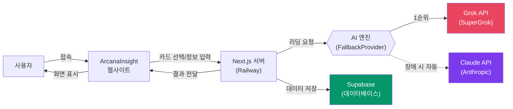
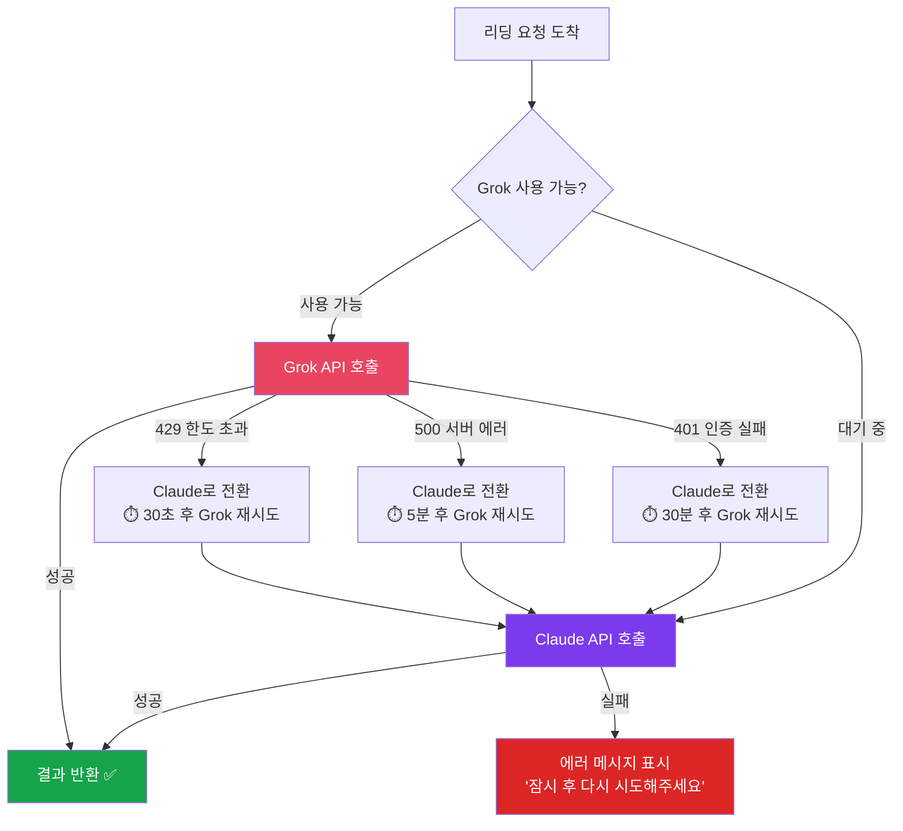
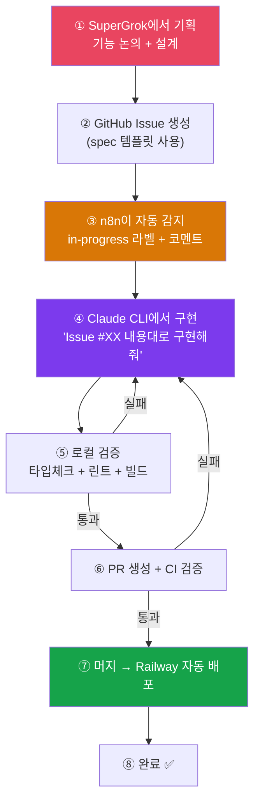
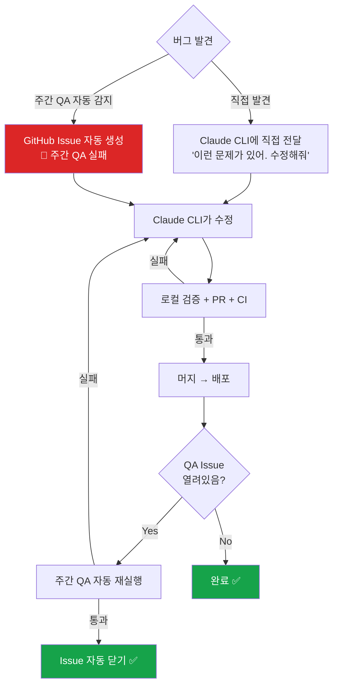
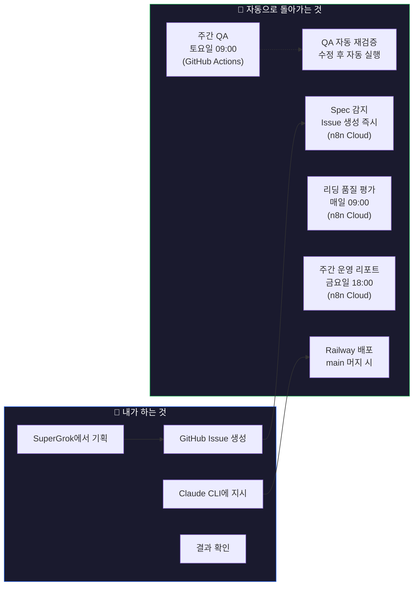
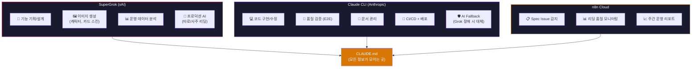

# ArcanaInsight 운영 가이드

운영자가 알아야 할 전체 흐름을 쉽게 정리한 문서입니다.

---

## 1. 서비스 전체 구조

사용자가 타로/사주 상담을 받기까지의 흐름입니다.

**한 줄 요약**: 사용자 → 웹사이트 → 서버 → AI(Grok 또는 Claude) → 결과 표시

---

## 2. AI 엔진 — Grok + Claude 자동 전환

AI 리딩은 **Grok이 기본**이고, 문제가 생기면 **Claude가 자동으로 대체**합니다.

**핵심 포인트**:
- 평소에는 Grok만 사용됩니다
- Grok에 문제가 생기면 **사용자가 모르는 사이에** Claude로 자동 전환됩니다
- 일정 시간 후 자동으로 Grok을 다시 시도합니다

---

## 3. 새 기능 개발 흐름 — SuperGrok → Claude CLI

새 기능을 기획하고 구현하는 전체 과정입니다.

**당신이 하는 일**:
1. SuperGrok에서 기능 기획/설계 논의
2. GitHub에서 Issue 생성 (spec 템플릿 선택)
3. Claude CLI에 "Issue #XX 내용대로 구현해줘"라고 전달
4. 결과 확인

**자동으로 되는 일**:
- n8n이 spec Issue를 감지하여 알림
- CI가 코드 품질 자동 검증
- Railway가 자동 배포

---

## 4. 버그 수정 흐름

버그를 발견했을 때의 처리 과정입니다.

**핵심 포인트**:
- 버그를 발견하면 Claude CLI에 바로 말하면 됩니다
- 주간 QA가 자동으로 버그를 찾아서 Issue를 생성합니다
- 수정 후 QA가 자동 재실행되어 확인합니다

---

## 5. 자동화 시스템 — 무엇이 자동으로 돌아가는가

### 자동 실행 일정

| 시간 | 무엇이 실행되는가 | 어디서 |
|------|-----------------|-------|
| **매일 09:00** | 리딩 품질 자동 평가 → 낮으면 Issue 생성 | n8n Cloud |
| **금요일 18:00** | 주간 운영 리포트 → Issue 생성 | n8n Cloud |
| **토요일 09:00** | 전체 QA 테스트 (3개 디바이스) → 실패 시 Issue | GitHub Actions |
| **PR 생성 시** | 코드 품질 검증 (린트 + 빌드 + E2E) | GitHub Actions |
| **main 머지 시** | Railway 자동 배포 + QA Issue 재검증 | Railway + GitHub |
| **spec Issue 생성 시** | n8n이 즉시 감지 → 구현 안내 코멘트 | n8n Cloud |

---

## 6. 환경별 역할 분담

---

## 7. 문제가 생겼을 때 — 빠른 참조

| 상황 | 해결 방법 |
|------|---------|
| **서비스가 안 될 때** | Grok API 장애 → Claude가 자동 대체 중. 방치하면 자동 복구 |
| **리딩 품질이 낮을 때** | n8n이 매일 자동 감지 → Issue 생성 → Claude CLI에 수정 지시 |
| **새 기능이 필요할 때** | SuperGrok에서 기획 → GitHub Issue(spec) → Claude CLI에 구현 지시 |
| **버그를 발견했을 때** | Claude CLI에 직접 전달: "이런 문제가 있어. 수정해줘" |
| **주간 QA 실패 알림** | GitHub Issue 확인 → Claude CLI에 수정 지시 → 자동 재검증 |
| **GitHub Actions 멈춤** | 무료 시간 소진 → 다음 달 자동 복구. 그동안 로컬 검증으로 대체 |

---

## 8. 핵심 URL 모음

| 서비스 | URL |
|--------|-----|
| **운영 사이트** | https://arcanainsight-production.up.railway.app |
| **GitHub 저장소** | https://github.com/xzawed/ArcanaInsight |
| **n8n Cloud** | https://xzawed.app.n8n.cloud |
| **Supabase** | Supabase 대시보드 (프로젝트 설정) |
| **Railway** | Railway 대시보드 (배포 관리) |
