# ArcanaInsight — 내부 프로세스 흐름도

## 전체 서비스 아키텍처

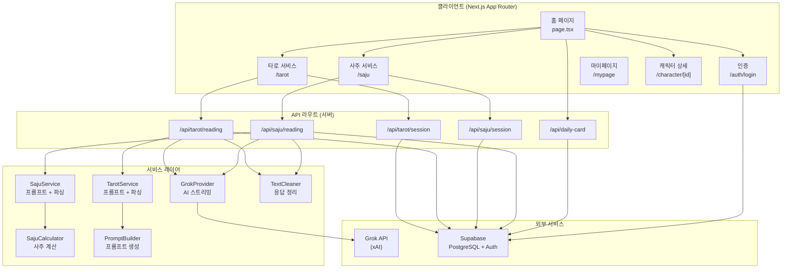

---

## 타로 서비스 흐름

### 사용자 여정 (4단계)

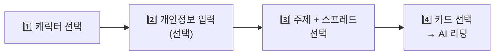

### 타로 상세 흐름

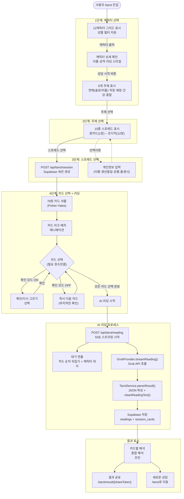

---

## 사주 서비스 흐름

### 사용자 여정 (4단계)

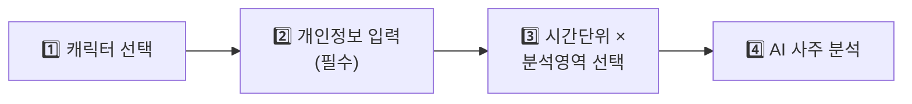

### 사주 상세 흐름

```mermaid
flowchart TD
    START(["사용자 /saju 진입"]) --> CHAR_SELECT

    subgraph STEP1["1단계: 캐릭터 선택"]
        CHAR_SELECT["12캐릭터 그리드 표시<br/>성별 필터 지원"]
        CHAR_SELECT --> |"캐릭터 클릭"| INFO_INPUT
    end

    subgraph STEP2["2단계: 개인정보 입력 (필수)"]
        INFO_INPUT["UserInfoForm<br/>이름·생년월일·출생시·성별"]
        INFO_INPUT --> |"입력 완료"| SAJU_SELECT
    end

    subgraph STEP3["3단계: 시간단위 × 분석영역"]
        SAJU_SELECT["시간단위 7개<br/>이번 주 ~ 전체 대운"]
        SAJU_SELECT --> TIME_SELECT{"시간단위 선택"}
        TIME_SELECT --> |"년단위 선택 시"| MONTHLY["월별 상세 토글<br/>(ON/OFF)"]
        TIME_SELECT --> AREA_SELECT
        MONTHLY --> AREA_SELECT

        AREA_SELECT["분석영역 8개<br/>종합운·연애·직장·건강·성격·궁합·택일"]
        AREA_SELECT --> |"모두 선택 완료"| START_BTN["사주 분석 시작 버튼"]
    end

    START_BTN --> SESSION_CREATE

    subgraph STEP4["4단계: AI 사주 분석"]
        SESSION_CREATE["POST /api/saju/session<br/>Supabase 세션 생성"]
        SESSION_CREATE --> CALC["SajuCalculator<br/>사주팔자 계산"]
    end

    CALC --> CALC_DETAIL

    subgraph CALCULATION["사주 계산 엔진"]
        CALC_DETAIL["천간·지지 계산<br/>연주·월주·일주·시주"]
        CALC_DETAIL --> ELEMENTS["오행 분포 분석<br/>목·화·토·금·수"]
        ELEMENTS --> STARS["십성 + 12운성<br/>합·충·형 관계"]
        STARS --> FORTUNE["대운·세운·월운<br/>계산"]
        FORTUNE --> YONGSIN["용신 판단<br/>신강/신약 분석"]
    end

    YONGSIN --> PROMPT_BUILD

    subgraph READING_FLOW["AI 리딩 프로세스"]
        PROMPT_BUILD["SajuService.buildSajuPrompt()<br/>사주 데이터 + 주제 지시문"]
        PROMPT_BUILD --> GROK_CALL["POST /api/saju/reading<br/>SSE 스트리밍"]
        GROK_CALL --> GROK_API["GrokProvider.streamReading()<br/>Grok API 호출"]
        GROK_API --> PARSE["SajuService.parseResult()<br/>JSON 파싱 + cleanReadingText()"]
        PARSE --> DB_SAVE["Supabase 저장<br/>saju_readings + sessions"]
    end

    DB_SAVE --> RESULT

    subgraph RESULT_PHASE["결과 표시"]
        RESULT["SajuChart 사주 차트<br/>OhaengGraph 오행 그래프<br/>DaeunTimeline 대운 타임라인"]
        RESULT --> READING_DISPLAY["종합 해석<br/>주제별 해석<br/>조언"]
        READING_DISPLAY --> SHARE["결과 공유"]
        READING_DISPLAY --> NEW["새로운 상담"]
    end
```

---

## AI 리딩 파이프라인 (타로/사주 공통)

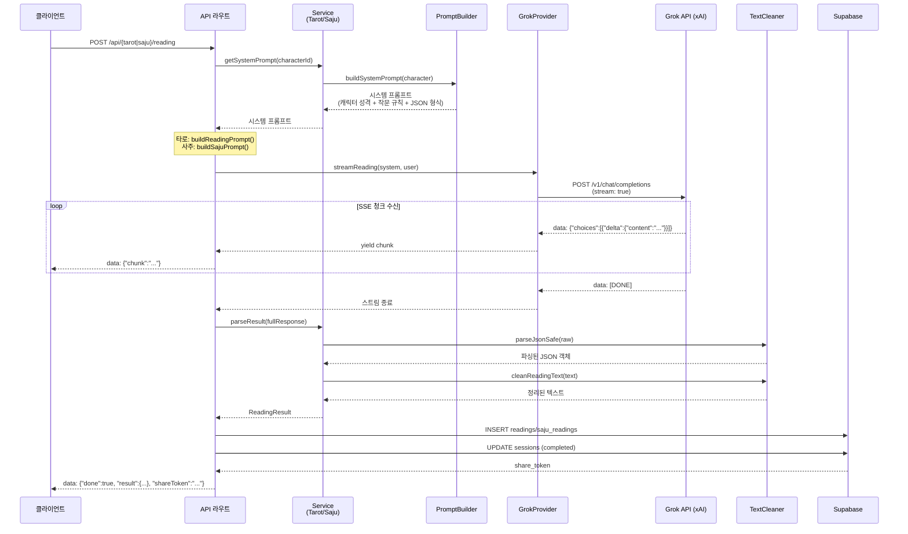

---

## 상태 관리 흐름 (Zustand)

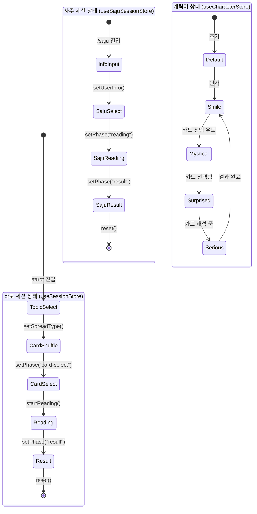

---

## 인증 흐름

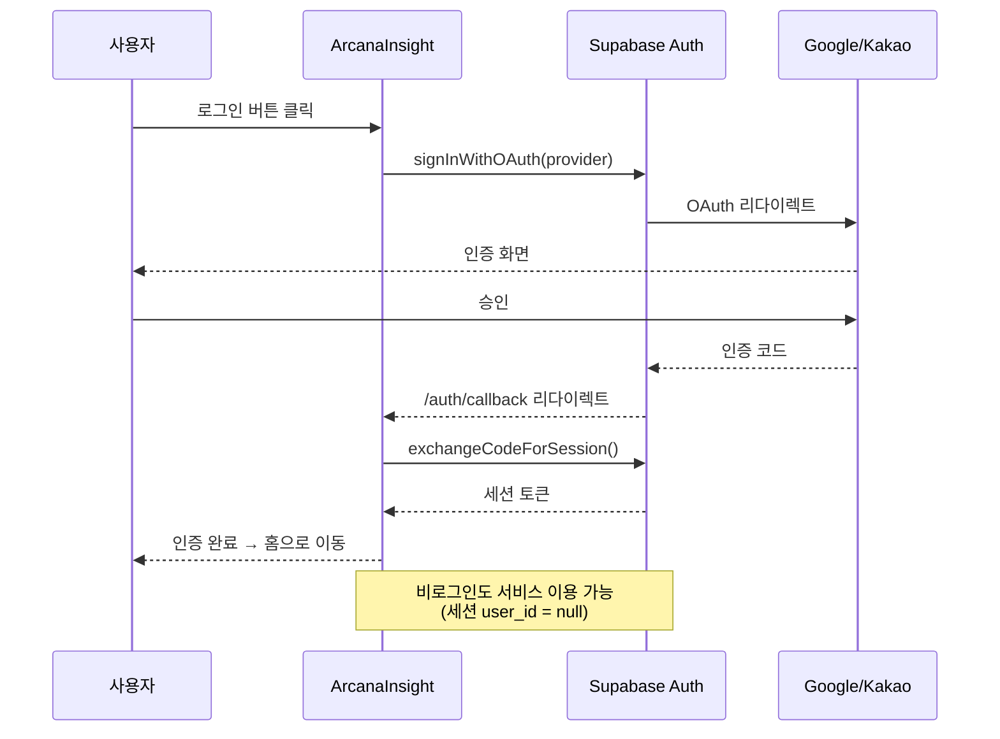

---

## 데이터베이스 스키마 관계

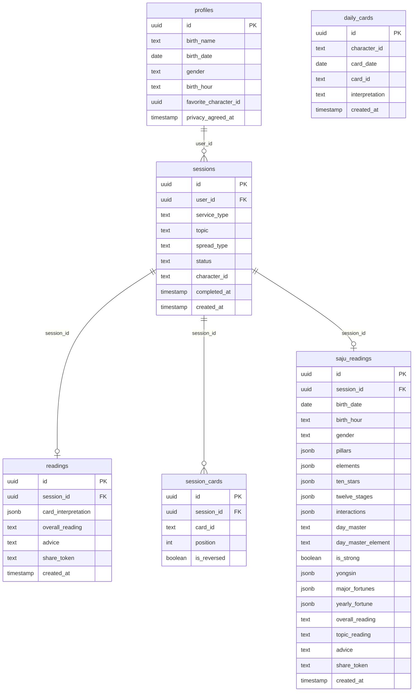

---

## 홈 페이지 구성 흐름

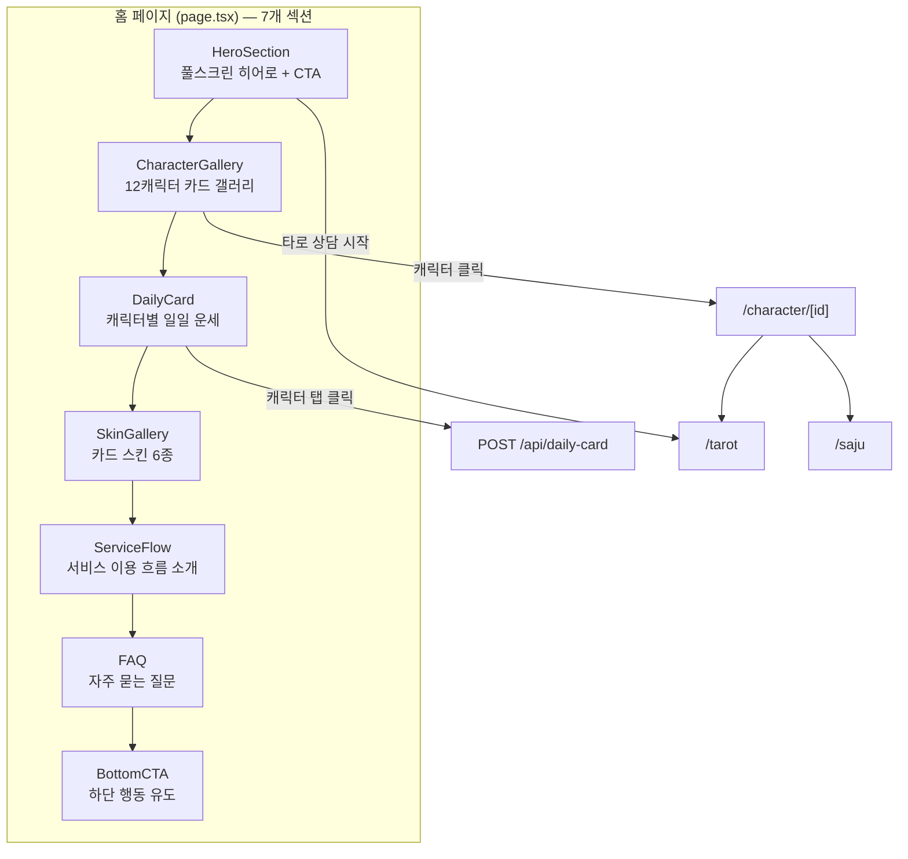

---

## 일일 카드 흐름

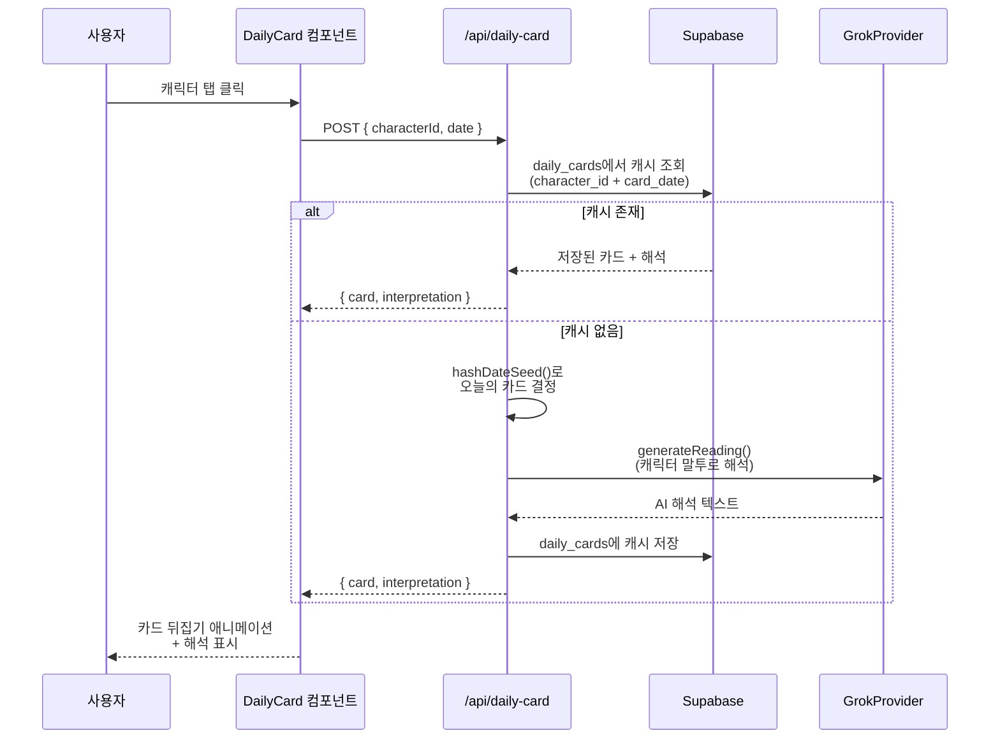

---

## 파일 구조 → 흐름 매핑

| 흐름 단계 | 주요 파일 |
|---|---|
| **홈 페이지** | `src/app/page.tsx`, `src/components/home/*` |
| **인증** | `src/app/auth/login/page.tsx`, `src/lib/supabase/*` |
| **타로 선택** | `src/app/tarot/page.tsx` |
| **타로 세션** | `src/app/tarot/session/page.tsx` |
| **타로 API** | `src/app/api/tarot/session/route.ts`, `src/app/api/tarot/reading/route.ts` |
| **타로 결과 공유** | `src/app/tarot/result/[id]/page.tsx` |
| **사주 선택** | `src/app/saju/page.tsx` |
| **사주 세션** | `src/app/saju/session/page.tsx` |
| **사주 API** | `src/app/api/saju/session/route.ts`, `src/app/api/saju/reading/route.ts` |
| **AI 프롬프트** | `src/services/core/prompt-builder.ts`, `src/services/saju/saju-service.ts` |
| **AI 호출** | `src/services/core/grok-provider.ts` |
| **응답 정리** | `src/services/core/text-cleaner.ts` |
| **사주 계산** | `src/services/saju/saju-calculator.ts` |
| **카드 데이터** | `src/data/cards/*`, `src/data/spreads/*` |
| **캐릭터 데이터** | `src/data/characters/*` |
| **상태 관리** | `src/hooks/useSession.ts`, `src/hooks/useSajuSession.ts`, `src/hooks/useCharacter.ts` |
